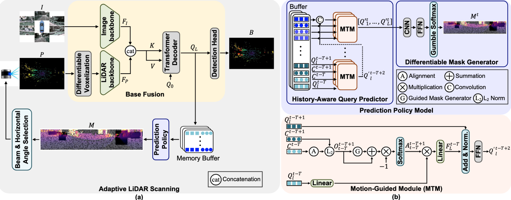

# Adaptive LiDAR Scanning: Harnessing Temporal Cues for Efficient 3D Object Detection via Multi-Modal Fusion

## Overview

This is the PyTorch code for our AAAI 2026 paper "Adaptive LiDAR Scanning: Harnessing Temporal Cues for Efficient 3D Object Detection via Multi-Modal Fusion
". 

[](https://arxiv.org/abs/2508.01562)
[](LICENSE)



## Introduction

Multi-sensor fusion using LiDAR and RGB cameras significantly enhances 3D object detection task. However, conventional LiDAR sensors perform dense, stateless scans, ignoring the strong temporal continuity in real-world scenes. This leads to substantial sensing redundancy and excessive power consumption, limiting their practicality on resource-constrained platforms. To address this inefficiency, we propose a predictive, history-aware adaptive scanning framework that anticipates informative regions of interest (ROI) based on past observations. Our approach introduces a lightweight predictor network that distills historical spatial and temporal contexts into refined query embeddings. These embeddings guide a differentiable Mask Generator network, which leverages Gumbel-Softmax sampling to produce binary masks identifying critical ROIs for the upcoming frame. Our method significantly reduces unnecessary data acquisition by concentrating dense LiDAR scanning only within these ROIs and sparsely sampling elsewhere. Experiments on nuScenes and Lyft benchmarks demonstrate that our adaptive scanning strategy reduces LiDAR energy consumption by over 65% while maintaining competitive or even superior 3D object detection performance compared to traditional LiDAR-camera fusion methods with dense LiDAR scanning.

## Installation

```bash
# Clone the repository
git clone https://github.com/sarashoouri/AdaptiveLiDAR.git
cd AdaptiveLiDAR

# Create conda environment
conda env create -f environment.yml
conda activate fusion

# Install the package
pip install -e .
```
## Preparation

* Environments  
Python == 3.8 \
CUDA == 11.1 \
pytorch == 1.9.0 \
mmcv-full == 1.6.0 \
mmdet == 2.24.0 \
mmsegmentation == 0.29.1 \
mmdet3d == 1.0.0rc5 \
spconv-cu111 == 2.1.21 \
[flash-attn](https://github.com/HazyResearch/flash-attention) == 0.2.2

## Data

Download Lyft 3D detection data [HERE](https://www.kaggle.com/c/3d-object-detection-for-autonomous-vehicles/data). Prepare Lyft data by running

```bash
python tools/create_data.py lyft --root-path ./data/lyft --out-dir ./data/lyft --extra-tag lyft --version v1.01
python tools/data_converter/lyft_data_fixer.py --version v1.01 --root-folder ./data/lyft
```

Download nuScenes V1.0 full dataset data [HERE](https://www.nuscenes.org/download).  Prepare nuscenes data by running

```bash
python tools/create_data.py nuscenes --root-path ./data/nuscenes --out-dir ./data/nuscenes --extra-tag nuscenes
```

Follow the [mmdet3d](https://github.com/open-mmlab/mmdetection3d/blob/master/docs/en/data_preparation.md) to process both datasets.

## Project Directory

It is recommended to symlink the dataset root to `$MMDETECTION3D/data`.
```
mmdetection3d/CMT
├── mmdet3d
├── tools
├── configs
├── data
│   ├── nuscenes
│   │   ├── maps
│   │   ├── samples
│   │   ├── sweeps
│   │   ├── v1.0-test
|   |   ├── v1.0-trainval
│   ├── lyft
│   │   ├── v1.01-train
│   │   │   ├── v1.01-train (train_data)
│   │   │   ├── lidar (train_lidar)
│   │   │   ├── images (train_images)
│   │   │   ├── maps (train_maps)
│   │   ├── v1.01-test
│   │   │   ├── v1.01-test (test_data)
│   │   │   ├── lidar (test_lidar)
│   │   │   ├── images (test_images)
│   │   │   ├── maps (test_maps)
│   │   ├── train.txt
│   │   ├── val.txt
│   │   ├── test.txt
│   │   ├── sample_submission.csv

```


## Disclaimer 
 
This is research-grade code, so it's possible you will encounter some hiccups. Contact me if you encounter problems or if the documentation is unclear, and I will do my best to help.

## Acknowledgement

This repository borrows partial codes from [CMT](https://github.com/junjie18/CMT/tree/master). Many thanks to them!

## Citation

If you use this project in your research, please cite:

```bibtex
@article{shoouri2025adaptive,
  title={Adaptive LiDAR Scanning: Harnessing Temporal Cues for Efficient 3D Object Detection via Multi-Modal Fusion},
  author={Shoouri, Sara and Taba, Morteza Tavakoli and Kim, Hun-Seok},
  journal={arXiv preprint arXiv:2508.01562},
  year={2025}
}
```
